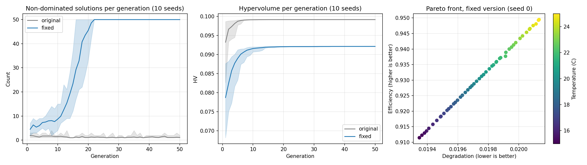

# EV Battery NSGA-II — 結案後重新驗證

這是我大學期間執行的國科會大專學生研究計畫（計畫編號 113-2813-C-130-080-E，
指導教授：李大衛，2024.07–2025.02）在結案後，由我本人重新檢驗與修正的紀錄。

原計畫以 NSGA-II 處理電動車電池「使用壽命」與「能源效率」之間的多目標權衡。
2026 年我重新檢視自己當初撰寫的程式，發現三個問題並加以修正。

## 發現的問題

1. **效率模型的計算錯誤**
   效率由三個因子相乘構成。充電與放電因子在數值偏高時會變成負數，兩個負數相乘得到
   正數，使計算出的效率被錯誤推升至上限。最佳化演算法因此將充放電率推向物理上不合理
   的極端值（例如充電率 18.6）。程式對輸出設有 0.6–0.98 的範圍限制，反而把這個異常
   修飾成看似正常的數值。

2. **收斂評估方式不適當**
   原先以「非支配解數量」判斷收斂，但該數量的上限即為族群大小（50）。只要柏拉圖前緣
   連續，數量必然趨近上限，無法反映解集合的品質。

3. **最佳解落在搜尋邊界**
   部分「最佳參數」實際上停在由資料計算出的變數上下界，屬於範圍設定造成的結果，
   而非最佳化的發現。

## 修正與重新驗證

- 將效率模型的每個因子下限設為 0，並把充放電率限制在合理範圍（充電 0.1–2、放電 0.1–3）
- 以 pymoo 的 `save_history` 記錄**實際**的收斂過程，取代原先手動輸入的數值
- 改以**超體積（hypervolume）** 評估解集合品質
- 以 **10 組隨機種子**重複執行，確認結果穩定性
- 移除原先的第三個目標：它比較的是未經訓練的網路分支輸出與一個寫死的常數

## 結果

| 設定 | 最終非支配解數 | 超體積達最終值 99% 的世代 |
|---|---|---|
| 原版（含錯誤） | 1–2 | 第 3.5 代（平均） |
| 修正版 | 50 | 第 8.6 代（平均，範圍 5–14） |

修正後的柏拉圖前緣顯示，真正的權衡僅存在於**溫度**這一個維度：溫度較低有利於降低
退化率，效率則在 25°C 附近最佳；充放電率與放電深度皆停在下界。此結果較原先單純，
但可重現、可解釋。

註：兩個版本的超體積不可直接比較，因為原版的效率數值被錯誤灌高。



## 檔案

| 檔案 | 說明 |
|---|---|
| `nsga2_rerun.py` | 重新驗證用的完整程式（pymoo 0.6.2） |
| `nsga2_rerun.png` | 非支配解數量、超體積收斂、修正後柏拉圖前緣 |
| `nsga2_rerun_seeds.csv` | 10 組隨機種子的逐次結果 |

## 執行方式

```bash
pip install pymoo pandas matplotlib
python nsga2_rerun.py
```

程式需讀取原計畫的 `fix/` 資料夾（15 個 CSV，共 480 筆樣本）。
原始行車資料取自慕尼黑工業大學公開的 BMW i3 真實行車資料集
（DOI: 10.21227/6jr9-5235）；該資料集本身不含 SoH，原計畫的 SoH 標籤為
前處理階段另行加上，產生方式未留下紀錄，此為原計畫的一項限制。

## 心得

最佳化演算法不會判斷目標函數是否合理，它只會忠實地找出讓數字最好看的解。
因此驗證中間的計算過程、檢查最佳解是否落在搜尋邊界，與演算法本身同樣重要。
